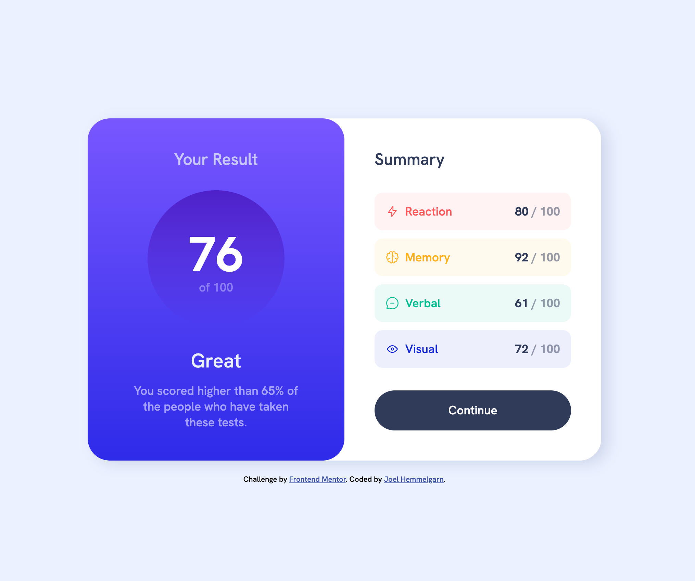

# Frontend Mentor - Results summary component solution

This is a solution to the [Results summary component challenge on Frontend Mentor](https://www.frontendmentor.io/challenges/results-summary-component-CE_K6s0maV). Frontend Mentor challenges help you improve your coding skills by building realistic projects. 

## Table of contents

- [Overview](#overview)
  - [The challenge](#the-challenge)
  - [Screenshot](#screenshot)
  - [Links](#links)
  - [Built with](#built-with)
  - [Continued development](#continued-development)
- [Author](#author)

## Overview

### The challenge

Users should be able to:

- View the optimal layout for the interface depending on their device's screen size
- See hover and focus states for all interactive elements on the page

### Screenshot

### Links

- Solution URL: [https://www.frontendmentor.io/solutions/results-summary-2yGfjirMfA](https://www.frontendmentor.io/solutions/results-summary-2yGfjirMfA)
- Live Site URL: [https://hemmejd.github.io/results-summary/](https://hemmejd.github.io/results-summary/)

## My process

### Built with

- Semantic HTML5 markup
- CSS custom properties
- Flexbox

### Continued development

- I want to continue to focus on Flexbox, and continue to master it.
- Need to work on the JavaScript portion of this project. I want to be able to make this dynamic, in the sense that users can put in any ratings they want, and the result should change.

## Author

- Frontend Mentor - [@HemmeJD](https://www.frontendmentor.io/profile/HemmeJD)
